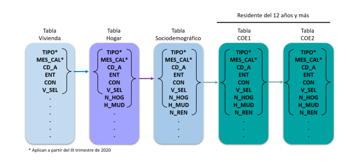

```{r setup, include=FALSE, coment = ""}
knitr::opts_chunk$set(echo = TRUE)
```
## Introducción

- Típicamente, para hacer un análisis cuantitativo necesitaremos varias tablas de datos combinadas entre sí.

- Colectivamente, a estas tablas se les llama "relational data".

- Para trabajar con relational data utilizaremos tres familias de verbos:

  1. Mutating joins: Agrega nuevas variables de un data frame a otro, haciendo match entre sus observaciones.
  
  2. Filtering joins: Filtramos observaciones de un data frame con base en si hacen match o no con alguna observación de otra tabla.
  
  3. Set operations: Trata a las observaciones como si fueran elementos de un conjunto.
  
## Ejemplo de relational data: ENOE
- La enoe se compone de 5 tablas que se relacionan entre sí



## Ejemplo de relational data: ENIGH

```{r, echo=FALSE, out.width="50%", fig.cap="ENIGH: Tablas y relaciones"}

```

## Variables llave (*keys*)

- Para conectar observaciones de diferentes data frames utilizaremos *keys*.

- Las *keys* pueden ser una sola variable o un conjunto de variables.

- Hay dos tipos de *keys*
  1. Primarias: Que identifican a una observación dentro de su propia tabla.
  3. Externas: Identifica a una observación en otros data frames.
  
  
## nycflights13

- Utilizaremos la base de datos `nycflights13`, incluida en la librería del mismo nombre. 
- Esta base contiene cinco tablas que se encuentran relacionadas.

```{r, echo=FALSE, out.width="50%", fig.cap="nycflights13"}
knitr::include_graphics("relational-nycflights.png")
```

## Mutating joins

- Con un mutating join podemos combinar dos data frames con base en los keys de cada observación

- Se llaman mutating joins porque, como el verbo `mutate()`, se agregan variables nuevas a un data frame.

- Hay diferentes clases de mutating joint. Cada uno lo utilizaremos según lo vayamos requiriendo:
  1. left_join(x,y): Conserva todas las observaciones en x
  2. right_join(x,y): Conserva todas las observaciones en y
  3. full_join(x,y): Conserva todas las observaciones en x y y.
  4. inner_join(x,y): Conserva solo las observaciones que aparezcan tanto en x como en y.

## Mutating joins

```{r, echo=FALSE, out.width="50%", fig.cap="Mutating joins"}
knitr::include_graphics("join.png")
```

## Mutating joins

- Imaginemos que queremos agregar el nombre de la aerolínea a la tabla de vuelos. Podemos hacerlo utilizando el verbo `left_join()`:

```{r, echo = F, warning=FALSE, include=F}
library(tidyverse)
library(nycflights13)
library(kableExtra)
```

```{r, echo=T, warning=F}
flights2 <- flights %>% 
  select(year:day, hour, tailnum, carrier) 

flights2 <-  left_join(flights2,airlines, by = "carrier")
```

```{r, echo=F, out.width="30%"}

kable(head(flights2),format = "latex", booktabs=TRUE) %>% 
  kable_styling(latex_options = "scale_down")
```

## Mutating joins: Duplicate keys

- Nos encontraremos con keys duplicadas cuando querramos relacionar datos con relación *one-to-may*.

```{r, echo=FALSE, out.width="50%", fig.cap="One-to-many join"}
knitr::include_graphics("join-one-to-many.png")
```


## Mutating joins: Duplicate keys

- Solamente una de las tablas debe tener duplicados, si las dos tienen duplicados será un error.

```{r, echo=FALSE, out.width="50%", fig.cap="many-to-many join"}
knitr::include_graphics("join-many-to-many.png")
```


## Filtering joins

- Estos joins funcionan como el verbo `filter()`. Por tanto, van a afectar a las observaciones y no a las variables.

1. semi_join(x,y): Conservará a todas las observaciones de x que hagan match con las observaciones de y.

2. anti_join(x,y): Conservará todas las observaciones de x que **NO** hagan match con alguna observación de y.


## Filtering joins

- No hay problema en relaciones many-to-many
```{r, echo=FALSE, out.width="40%", fig.cap="Semi join"}
knitr::include_graphics("join-semi.png")
```
```{r, echo=FALSE, out.width="40%", fig.cap="Semi join many-to-many"}
knitr::include_graphics("join-semi-many.png")
```

## Ejercicio

1. Con la ENOE:
    a. Calcule la tasa de informalidad por estado. Hint: Utilice la variable emp_ppal.
    b. El porcentaje de trabajadores que ganan menos de un salario mínimo por estado. Hint: Utilice la variable salario (salario mínimo mensual)
    c. Guarde ambos estadísticos en un solo df.
  
2. Con la ENIG:
    a. Por estado, calcule qué porcentaje de hogares que viven en condiciones de pobreza y pobreza extrema por ingresos. Hint: La línea de pobreza extrema es de 2124.70 por persona y la línea de pobreza es de 4246.06 por persona. Utilice la variable tot_integ (Total de integrantes del hogar)

3. Combine los data frame y calcule la correlación entre el porcentaje de hogares que viven en pobreza y la tasa de informalidad/porcentaje de trabajadores que ganan menos que el mínimo.